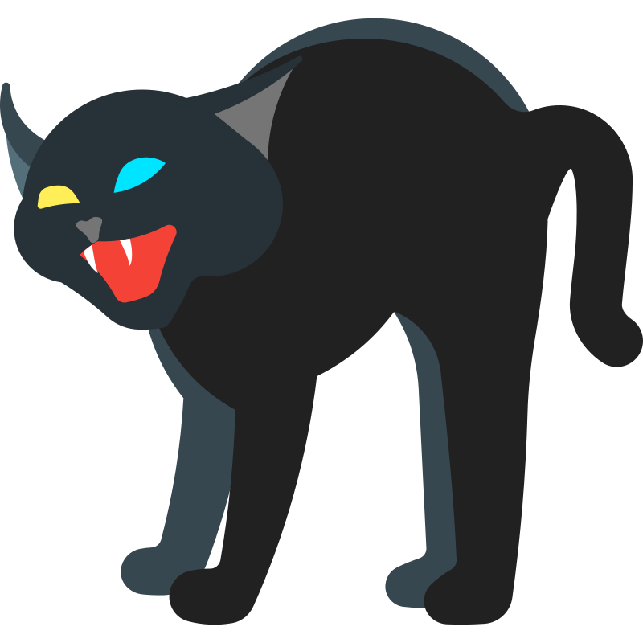

  

# Wicek

> Task-focused AI assistant running as a Discord bot, powered by Claude Code

A minimal Node.js application that wraps the unmodified [Claude Code](https://claude.ai/code) CLI binary and exposes it through Discord. Built to replace a bloated third-party Kubernetes operator ([openclaw-rocks](https://github.com/openclaw-rocks)) with something lean and maintainable.

> [!WARNING]
> This project is experimental. Expect breaking changes, rough edges, and incomplete features.

## Motivation

[OpenClaw](https://openclaw.rocks) is a capable AI agent platform with a broad feature set – multiple messaging channels, vector memory, browser automation, self-configuration, and more. For a single-user setup on a Raspberry Pi where only Discord and a handful of tools are needed, most of that goes unused. Wicek replaces it with ~500 lines of TypeScript, a single Deployment, and a Helm chart.

## What it does

- **Discord integration** – DMs, @mentions, and threaded conversations via [discord.js](https://discord.js.org/)
- **Claude Code wrapper** – spawns `claude -p` per request using a Pro/Max subscription (no need for API billing), streams NDJSON back to Discord with thinking (blockquotes), tool use, and text
- **Browser automation** – headless Chrome sidecar with [Chrome DevTools MCP](https://github.com/nicolo-ribaudo/chrome-devtools-mcp), screenshots auto-attached to Discord
- **Cron jobs** – GitOps-defined scheduled prompts (e.g., daily ETF updates)
- **Custom subagents** – `.claude/agents/` for ETF analysis, infrastructure ops, Home Assistant
- **File handling** – receives Discord attachments, sends back generated files and screenshots
- **Self-update** – knows how to push changes through the GitOps pipeline (git -> ArgoCD)
- **Long-term memory** – Claude Code's native auto-memory on persistent storage

## Deployment

Runs on a single-node K3s cluster (Raspberry Pi 4). See [xxczaki/homelab](https://github.com/xxczaki/homelab) for the full cluster setup and [xxczaki/charts](https://github.com/xxczaki/charts) for the Helm chart.

## AI disclosure

This project contains code generated by Large Language Models (LLMs), under human supervision and proofreading.

## License

MIT
